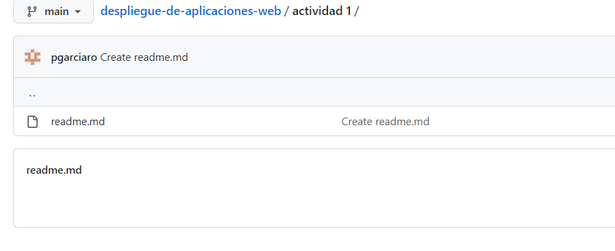

1. 
2. 
3. 

El login token sirve como metodo de autenticacion que un usuario necesita para acceder a una aplicacion o sistema de red de una forma mas segura.
Una vez has iniciado sesion en una pagina web como el moodle con un login. Hay diferentes tipos de headers; el general, el de respuesta y el  de solicitud. 

Dentro de los headers el que nos interesa una vez hemos iniciado sesión, son los headers de respuesta.

Cache control: sirve para controlar el almacenamiento temporal en navegadores y caches compartidas.

Content language: el idioma 

Content type: tipo de contentido de la pagina

Date: indica el dia y hora 

Expires: el tiempo o fecha en cuando caduca el login.

Location: es en el sitio http donde estas. Ejemplo: https://gimbernat.esemtia.net/moodle/login/index.php?testsession=422

Pragma: es un encabezado especifico de la implementación que puede tener varios efectos a lo largo de la cadena de solicitud-respuesta. Se utiliza para la compatibilidad con versiones anteriores en memorias caché. 

Server: el servidor en el que se esta ejecutando. En este caso Ubuntu 

Set-Cookie: se usa para enviar cookies desde el servidor al agente de usuario, asi el agente de usuario puede mandarlo de vueltas. 

Strict-transport-security: Te informa y advierte que dicha pagina web solo se puede abrir con HTTPS, en caso de no hacerlo cambiara automaticamente a HTTP.

Transfer-encoding: especifica la forma de codificacion para transferir de forma segura el cuerpo de forma util para el usuario.

x-content-type-options: Es utilizado por el servidor para indicar que los tipos MIME deben seguirse y no cambiarse. 

x-frame-options: sirve para evitar ataques de secuestros de clicks, asegurandose asi de que su contenido

x-redirect-by: Redirige informacion con un sistema de gestion. 

x-xss-protection: Esto impide la carga de una pagina cuando detecta ataques de tipo crossite

Los datos sensibles son los datos personales del usuario, que estan guardados con mas protección.

4. 

¿A qué puerto se reciben normalmente las peticiones del protocolo HTTP?

En TCP el puerto por defecto en un servidor HTTP es en el puerto 80. 

¿A qué capa del modelo TCP/IP se encuentra el protocolo HTTP?

Coresponde a las capas 5, 6 y 7 del modelo OSI.

¿Y los protocolos TCP, UDP, e IP?

TCP en la capa 1. UDP en la capa 3. IP en la capa 1 y 2. 

5. 
HTTP/1.1 302 Found: Indica que el recurso solicitado ha sido movido temporalmente a la URL dada por las cabeceras Location(en-US). El navegador te redirecciona a esta pagina, pero los motores de busqueda no actualizan sus enlaces al recurso.

Location: http://www.example.com/test/index2.php: 

6. 

Con la direccion IP 142.250.178.163 me ha funcionado. 